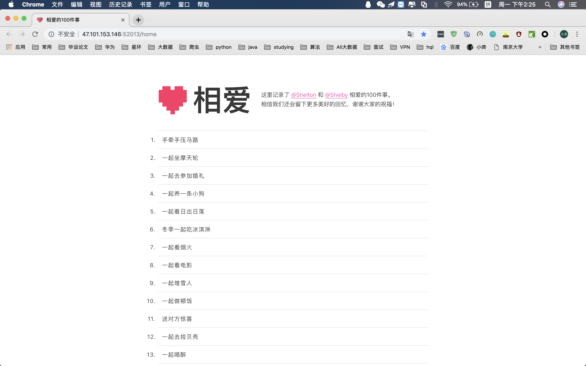

应家里小可爱的要求搭建一个极其轻量级的网站，记录一下我们共同完成的100件事。

地址：http://47.101.153.146:52013/home

大概用了一个中午的时间

最大可能地重用，最大可能地精简。

使用的是Spring Boot，打成jar包，部署在阿里云上。

主要是部署，真的真的用了最简单的方式了。

直接在java -jar在服务器上运行，为了避免因为Shell命令窗口关闭导致程序运行结束，所以使用了管道来实现运行。

- 首先先用vim创建文件`start.sh`

- 在文件中写入`java -jar xxx.jar`

- 在保存一下：`wq`

- 给文件 `chmod 777 start.sh` 权限

- 其次:`nohup  ./start.sh &`就可以运行了。

效果：

